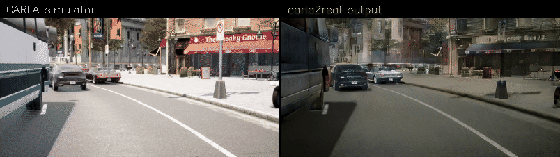
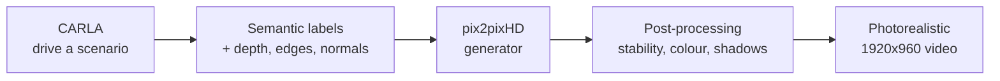

<div align="center">

# carla2real

**Turn CARLA simulation into photorealistic driving video — for testing perception systems.**

[](LICENSE)
[](weights/LICENSE)
[](datasets/README.md)
[](https://carla.org)

⭐ Star us on GitHub if you find this useful!

</div>



<div align="center"><i>Left: CARLA. Right: the same drive, rendered photorealistic. Same camera, same traffic.</i></div>

## Why this exists

Perception systems need to be tested on rare and dangerous scenarios — a child stepping out from
behind a parked van, a car braking hard in fog at night. Those are cheap to *author* in a simulator
and expensive or impossible to *film* on a real road.

The problem is that simulator footage doesn't look real, so a perception model trained on real
video often fails on it for the wrong reasons. **carla2real closes that gap**: you author the
scenario in CARLA, and get video a perception stack treats like a real camera feed.

## What it does

- 🎥 **Photorealistic video from any CARLA scenario** — any town, weather, traffic, time of day
- 🌞🌙 **Two dedicated models** — one for daylight, one for night
- 📊 **Measurable** — scored against ground truth using an external perception stack
- ⚖️ **Openly licensed training data** — PandaSet and the Zenseact Open Dataset, nothing
  research-only
- 🎯 **Stable, not flickery** — the usual failure of frame-by-frame generation is that every frame
  invents a slightly different world; extra depth, edge and lighting inputs pin it down

## How it works



The generator turns a semantic label map — *road here, car there* — into an image. On its own that
isn't enough: a label map says "building" but not *which* building, so the model invents a different
facade every frame and the video shimmers. Feeding it depth, edges, surface normals and lighting
from the simulator pins the world down so it stays the same from frame to frame.

## Getting started

<details>
<summary><b>Step 1 — Install</b></summary>

Requires [CARLA 0.9.16](https://carla.org) and Python 3.10+, with an NVIDIA GPU for rendering.

```bash
git clone https://github.com/Terbz98/CARLAtoreal.git
cd CARLAtoreal
pip install -r requirements.txt
```

Create the data directories:

```bash
python3 scripts/init_asset_dirs.py
```

Bulk data lives outside the repository. Either accept the defaults (`./datasets`, `./output`) or
point `CARLA2REAL_DATA` and `CARLA2REAL_OUT` somewhere with space — a five-town run is tens of GB.

</details>

<details>
<summary><b>Step 2 — Get the model weights</b></summary>

Weights are published as release assets, not committed (they are 350 MB each).

```bash
bash scripts/weights/fetch.sh
```

They are licensed **CC BY-SA 4.0** — different from the code. See [`weights/README.md`](weights/README.md).

</details>

<details>
<summary><b>Step 3 — Record a scenario in CARLA</b></summary>

Start the simulator, then drive a town on autopilot while capturing camera and semantic output:

```bash
# start CARLA (headless)
~/carla/CARLA_0.9.16/CarlaUE4.sh -RenderOffScreen -world-port=2000 &

# record 1000 frames of Town05 in daylight
python3 -m carla2real.recording.record_town_auto \
  --town Town05 --weather sunny --outname Town05_sunny_inst
```

This writes RGB frames, semantic labels and a speed log to
`$CARLA2REAL_DATA/recorded_Town05_sunny_inst/`.

</details>

<details>
<summary><b>Step 4 — Render it photorealistic</b></summary>

```bash
# daylight
TEXTURE=1 bash scripts/inference/render_model.sh sunny \
  carla2real_semantic_v85_zod_fixed v85 Town05

# night
bash scripts/inference/render_model.sh night \
  carla2real_semantic_v79_clean_night v79 Town05
```

Daylight needs two more steps, which is where a large part of the quality comes from — colour
grading and rebuilt ground shadows:

```bash
TAG=v85q BASE_TAG=v85 COLOUR_SRC=v50m bash experiments/delivery/make_v50r.sh
python3 -m carla2real.postprocessing.deepen_road_shadows <in.mp4> <carla_rgb/> <labels/> <out.mp4> 2.5
```

The finished 1920×960 video lands in `$CARLA2REAL_OUT/`.

</details>

<details>
<summary><b>Step 5 (optional) — Score it against ground truth</b></summary>

If you have a perception stack, point `PERCEPTION_ROOT` at it and compare its output on the
generated video against CARLA's ground truth:

```bash
python3 -m carla2real.evaluation.score_vp <gt.json> <perception.log> --json out.json
```

Feed it **1024×512**, not the full 1920×960 — lateral accuracy is several times worse at the
larger size.

</details>

## Results

Measured with an external perception stack against CARLA ground truth — five towns, 1000 frames
each. CIPO recall is how reliably the closest in-path object is detected; lane error is lateral
position accuracy.

| Condition | Model | CIPO recall ↑ | Lane error ↓ | Training data |
|---|---|---|---|---|
| ☀️ Daylight | **v85d** | **0.891** | 0.195 m | PandaSet + ZOD |
| 🌙 Night | **v79** | **0.888** | 0.226 m | PandaSet + ZOD |

Both models are trained only on openly licensed data, and both are the best results this project
has produced on these scenes. The numbers come from the perception stack reading the rendered video
and being compared against what CARLA knows was actually there.

## Licensing at a glance

| | Licence | Commercial use |
|---|---|---|
| Code | Apache 2.0 | ✅ |
| Model weights | CC BY-SA 4.0 | ✅ with share-alike |
| Training data | [PandaSet](https://pandaset.org) CC BY 4.0 · [ZOD](https://zod.zenseact.com) CC BY-SA 4.0 | ✅ |

Weights are share-alike because ZOD is, and trained weights are treated as a derivative of their
training data. Full detail in [`THIRD_PARTY_NOTICES.md`](THIRD_PARTY_NOTICES.md).

## Documentation

| | |
|---|---|
| [Pipeline reference](docs/PIPELINE.md) | Every stage in detail, and the measurements behind each decision |
| [Inference flow audit](docs/INFERENCE_FLOW.md) | Traced data flow and known gaps |
| [Asset guide](docs/ASSET_DOWNLOADS.md) | What to download and where it goes |
| [Datasets](datasets/README.md) | Training corpora, download links and licences |
| [Experiment history](docs/EXPERIMENTS.md) | What was tried, what failed, and why |

> **Status:** this is a research project, not a packaged product. The commands above are the
> documented recipes; some preprocessing stages are still being reconnected after a restructure.
> See the [inference flow audit](docs/INFERENCE_FLOW.md) for exactly which.

## Acknowledgements

Built on [pix2pixHD](https://github.com/NVIDIA/pix2pixHD) (NVIDIA), [CARLA](https://carla.org),
[Mask2Former](https://github.com/facebookresearch/Mask2Former) and
[MoGe](https://github.com/microsoft/MoGe). Developed at ITRI.
