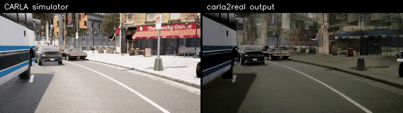
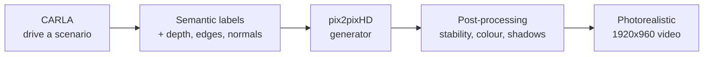

<div align="center">

# carla2real

**Turn CARLA simulation into photorealistic driving video, for testing perception systems.**

[](LICENSE)
[](weights/LICENSE)
[](#weight-provenance)
[](https://carla.org)

</div>



<div align="center"><i>Left: CARLA. Right: the same drive, rendered photorealistic. Same camera, same traffic.</i></div>

## Why this exists

Perception systems need to be tested on rare and dangerous scenarios: a child stepping out from
behind a parked van, a car braking hard in fog at night. Those are cheap to *author* in a simulator
and expensive or impossible to *film* on a real road.

The problem is that simulator footage doesn't look real, so a perception model trained on real
video often fails on it for the wrong reasons. **carla2real closes that gap**: you author the
scenario in CARLA, and get video a perception stack treats like a real camera feed.

## What it does

- 🎥 **Photorealistic video from any CARLA scenario.** Any town, weather, traffic, time of day
- 🌞🌙 **Two dedicated models.** One for daylight, one for night
- 📊 **Measurable.** Scored against ground truth using an external perception stack
- ⚖️ **Openly licensed fine-tuning data.** The current models are fine-tuned on PandaSet and the
  Zenseact Open Dataset only. Their starting weights are older, though; see
  [Weight provenance](#weight-provenance)
- 🎯 **Stable, not flickery.** The usual failure of frame-by-frame generation is that every frame
  invents a slightly different world; extra depth, edge and lighting inputs pin it down

## How it works


```mermaid
flowchart LR
    A[CARLA<br/>drive a scenario] --> B[Semantic labels<br/>+ depth, edges, normals]
    B --> C[pix2pixHD<br/>generator]
    C --> D[Post-processing<br/>stability, colour, shadows]
    D --> E[Photorealistic<br/>1920x960 video]
```

The generator turns a semantic label map (*road here, car there*) into an image. On its own that
isn't enough: a label map says "building" but not *which* building, so the model invents a different
facade every frame and the video shimmers. Feeding it depth, edges, surface normals and lighting
from the simulator pins the world down so it stays the same from frame to frame.

## Getting started

<details>
<summary><b>Step 1. Install</b></summary>

Requires [CARLA 0.9.16](https://carla.org) and Python 3.10+, with an NVIDIA GPU for rendering.

```bash
git clone https://github.com/Terbz98/CARLAtoreal.git
cd CARLAtoreal
pip install -r requirements.txt
```

Create the data directories:

```bash
python3 scripts/init_asset_dirs.py
```

Bulk data lives outside the repository. Either accept the defaults (`./datasets`, `./output`) or
point `CARLA2REAL_DATA` and `CARLA2REAL_OUT` somewhere with space. A five-town run is tens of GB.

</details>

<details>
<summary><b>Step 2. Get the model weights</b></summary>

Weights are **not published yet**. The current checkpoints descend from earlier models that were
trained on research-only data (see [Weight provenance](#weight-provenance)), so they will be released
only once a from-scratch, licensed-only model replaces them. When they are, they ship as release
assets (350 MB each), not committed files:

```bash
bash scripts/weights/fetch.sh
```

They are licensed **CC BY-SA 4.0**, which is different from the code. See [`weights/README.md`](weights/README.md).

</details>

<details>
<summary><b>Step 3. Record a scenario in CARLA</b></summary>

Start the simulator, then drive a town on autopilot while capturing camera and semantic output:

```bash
# start CARLA (headless)
~/carla/CARLA_0.9.16/CarlaUE4.sh -RenderOffScreen -world-port=2000 &

# record 1000 frames of Town05 in daylight
python3 -m carla2real.recording.record_town_auto \
  --town Town05 --weather sunny --outname Town05_sunny_inst
```

This writes RGB frames, semantic labels and a speed log to
`$CARLA2REAL_DATA/recorded_Town05_sunny_inst/`.

</details>

<details>
<summary><b>Step 4. Render it photorealistic</b></summary>

```bash
# daylight
TEXTURE=1 bash scripts/inference/render_model.sh sunny \
  carla2real_semantic_v90 v90 Town05

# night (v93n: trained from scratch on licensed data; weights in the GitHub release)
bash scripts/inference/render_model.sh night \
  carla2real_semantic_v93n v93n Town05
# then a subtle warm tint on the light sources (sodium-lamp look)
python3 -m carla2real.postprocessing.warm_lights <in.mp4> <out.mp4>
```

Daylight needs more steps, which is where a large part of the quality comes from: colour grading,
rebuilt ground shadows, and two passes that take from CARLA what the model cannot know:

```bash
TAG=v90q BASE_TAG=v90 COLOUR_SRC=v50m bash experiments/delivery/make_v50r.sh
python3 -m carla2real.postprocessing.deepen_road_shadows <in.mp4> <carla_rgb/> <labels/> <out.mp4> 2.5

# vehicles: shading, panel structure, livery and true paint colour from CARLA, per vehicle
python3 -m carla2real.postprocessing.vehicle_pass <in.mp4> <carla_rgb/> <labels/> <out.mp4>

# distance: vegetation loses colour and far objects pick up haze, as real cameras see them
SAT_NEAR=0.85 SAT_FAR=0.55 HAZE=0.18 \
  python3 -m carla2real.postprocessing.aerial_pass <in.mp4> <labels/> <depth/> <out.mp4>

# optional, experimental: soften over-sharp, cartoonish foliage
python3 -m carla2real.postprocessing.tree_soften <in.mp4> <labels/> <out.mp4>
```

The finished 1920×960 video lands in `$CARLA2REAL_OUT/`.

</details>

<details>
<summary><b>Step 5 (optional). Score it against ground truth</b></summary>

If you have a perception stack, point `PERCEPTION_ROOT` at it and compare its output on the
generated video against CARLA's ground truth:

```bash
python3 -m carla2real.evaluation.score_vp <gt.json> <perception.log> --json out.json
```

Feed it **1024×512**, not the full 1920×960. Lateral accuracy is several times worse at the
larger size.

</details>

## Results

Measured with an external perception stack against CARLA ground truth, over five towns of 1000 frames
each. CIPO recall is how reliably the closest in-path object is detected; lane error is lateral
position accuracy.

| Condition | Model | CIPO recall ↑ | Lane error ↓ | Training data |
|---|---|---|---|---|
| ☀️ Daylight | **v90dv** | 0.877 | 0.197 m | PandaSet + ZOD (fine-tuned) |
| ☀️ Daylight, no vehicle pass | v90d | **0.894** | 0.191 m | PandaSet + ZOD (fine-tuned) |
| 🌙 Night | **v93n** | 0.710 | 0.221 m | PandaSet + ZOD (**trained from scratch**, weights published) |
| 🌙 Night, previous | v79 | **0.888** | 0.226 m | PandaSet + ZOD (fine-tuned, not published) |

The daylight baseline is **v90dv**, chosen by eye. The vehicle pass restores what the label map never
told the model, such as an ambulance's markings and each car's real paint colour, and it fixes cars
the model used to paint in two tones. It costs about 1.7 points of detection recall against v90d,
which has the highest score this project has produced. Use v90d when the perception number matters
more than appearance. The numbers come from the perception stack reading the rendered video and
being compared against what CARLA knows was actually there.

v90 is fine-tuned on PandaSet (all three forward cameras, daylight frames only, colour-matched) and
10,000 ZOD frames.

The night baseline is **v93n**, chosen by eye over v79. It is the first model trained from random
initialisation on licensed data only, so its weights can be published. It scores lower on CIPO than
v79, mostly on one town (Town04, a motorcyclist rendered too dark); longer-trained versions of it
(v95n, v96n) reach 0.84 but were not preferred visually.

## Licensing at a glance

| | Licence | Commercial use |
|---|---|---|
| Code | Apache 2.0 | ✅ |
| Model weights | CC BY-SA 4.0 | ✅ with share-alike |
| Training data | [PandaSet](https://pandaset.org) CC BY 4.0 · [ZOD](https://zod.zenseact.com) CC BY-SA 4.0 | ✅ |

Weights are share-alike because ZOD is, and trained weights are treated as a derivative of their
training data. Full detail in [`THIRD_PARTY_NOTICES.md`](THIRD_PARTY_NOTICES.md).

### Weight provenance

The **night** baseline v93n was trained from random initialisation on PandaSet and ZOD only, and its
fp16 weights are published as a release asset (`scripts/weights/fetch.sh`). The **daylight** baseline
is fine-tuned, not trained from scratch. Its final training data is PandaSet and ZOD only, but its
starting weights come from a chain of earlier checkpoints:

- **Daylight** v90 descends from v75, v73 and v50, which trained on Mapillary Vistas
  (non-commercial), Cityscapes (research only) and driving video whose licence was never established.
- The previous night baseline v79 descends from v76, v69, v51 and v47, which trained on Dark Zurich
  and night driving video of the same unestablished provenance.

If trained weights count as a derivative of their training data, which is the reasoning this project
already applies to ZOD's share-alike, then these checkpoints carry those restrictions. **For that
reason they are not published.** A daylight model trained from scratch (v92c,
`scripts/training/train_from_scratch_sunny.sh`) exists and is about one CIPO point behind v90dv.

## Documentation

| | |
|---|---|
| [Pipeline reference](docs/PIPELINE.md) | Every stage in detail, and the measurements behind each decision |
| [Inference flow audit](docs/INFERENCE_FLOW.md) | Traced data flow and known gaps |
| [Asset guide](docs/ASSET_DOWNLOADS.md) | What to download and where it goes |
| [Datasets](datasets/README.md) | Training corpora, download links and licences |
| [Experiment history](docs/EXPERIMENTS.md) | What was tried, what failed, and why |

> **Status:** this is a research project, not a packaged product. The commands above are the
> documented recipes; some preprocessing stages are still being reconnected after a restructure.
> See the [inference flow audit](docs/INFERENCE_FLOW.md) for exactly which.

## Acknowledgements

Built on [pix2pixHD](https://github.com/NVIDIA/pix2pixHD) (NVIDIA), [CARLA](https://carla.org),
[Mask2Former](https://github.com/facebookresearch/Mask2Former) and
[MoGe](https://github.com/microsoft/MoGe). Developed at ITRI.
